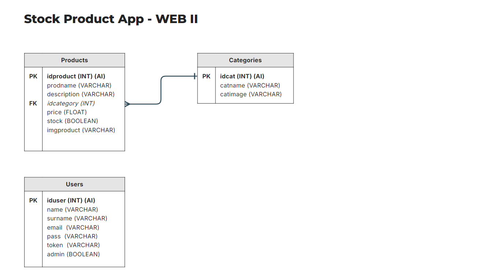

# API de Gestión de Productos y Categorías

## Autor
- Gabriel Marrero (gab.bmar.05@gmail.com)

## Temática
API RESTful desarrollada para llevar el registro, control y gestión de diversos productos en stock.

## Descripción
Es una API que permite a los usuarios realizar tanto lecturas de múltiples productos, como también de un registro/producto en particular.

La API permite la obtención de registros a partir de un determinado campo(attribute) en forma ascendente(por default) o descendente, permitiendo así el ordenamiento de los productos por distintos criterios como por ejemplo precio, id de producto, nombre, etc. Además, la obtención de productos también puede realizarse a través de filtros, en donde el envío de un valor determinado obtendrá las coincidencias en un determinado campo y devolverá uno(o ninguno en caso de no haber coincidencia) o más productos en caso de existir en la base de datos.

Por último, los usuarios podrán realizar acciones CRUD(Crear, Leer, Actualizar y Eliminar) sobre los productos en la base de datos, teniendo en cuenta que para realizar solicitudes de actualización o creación de productos, deberán primero loguearse y luego utilizar un código token para validar las solicitudes y que las modificaciones sean validadas y ejecutaas.

## Funcionalidades
    - Lectura de todos los productos.
    - Lectura de un producto en particular.
    - Creación de un producto.
    - Actualización de un producto.
    - Eliminación de un producto.
    - Filtro de productos por un campo/atributo en particular.
    - Ordenamiento de productos por un campo/atributo en particular.
    - Login y creación de token para realizar solicitudes de actualización (PUT) y creación (POST) de productos.
    - Filtro de productos por un campo en particular y ordenamiento de productos por un campo en particular.
    - Todas las funcionalidades anteriormente expresadas también aplican para las categorías.

## Estructura del proyecto
El proyecto se estructura en las siguientes carpetas:

* _stock-product-API:_ carpeta padre que contiene el proyecto completo.
* _app:_ carpeta que contiene los folder de modelos, controladores y vistas.
* _model:_ carpeta que contiene los modelos de datos.
* _controller:_ carpeta que contiene los controladores de la aplicación.
* _view:_ carpeta que contiene la lógica de códigos de respuesta de la aplicación.
* _config:_ contiene archivo de configuración que almacena las constantes pertenecientes a la conexión con la DB.
* _data:_ carpeta que contiene el código SQL para la creación de la base de datos y diagrama DER.
* _router:_ carpeta que contiene lógica de adición, ejecución y matcheo de las rutas de la aplicación.
* _archivos anexos:_ el proyecto también contiene archivos de configuración para la utilización de rutas semánticas como el routerapi.php y .htaccess.

## Herramientas y tecnologías
- PHP
- MySQL

## Diagrama de Entidad-Relación

### Imagen

## Endpoints

### Productos

* `GET /products`: Obtiene la lista de productos ordenados por su ID por default.

* `GET /products?attribute=valor`: Obtiene la lista de productos ordenada de manera ascendente(por default) por un atributo específico.
    _Ejemplo de uso: /products?attribute=price_

* `GET /products?attribute=valor&order=asc/desc`: Obtiene la lista de productos ordenada por un atributo específico y ordenada en forma ascendente o descendente según se asigne.
    _Ejemplo de uso: /products?attribute=idproduct&order=DESC_

* `GET /products?filter=campo&value=valor`: Obtiene la lista de productos existentes que coinciden con el valor asignado al parámetro 'value' en su atributo/campo, el cual es asignado al parámetro 'filter'.
    _Ejemplo de uso: /products?filter=prodname&value=inserte-nombre-de-producto_

* `GET /products/:id`: Obtiene un producto específico mediante su ID de producto.
    _Ejemplo de uso: /products/1_

* `DELETE /products/:id`: Elimina un producto.
    _Ejemplo de uso: /products/1_

_En el caso de las solicitudes POST o PUT, previamente se deberá realizar el login del usuario con sus credenciales de 'email' y 'pass'. Luego, se obtendrá un token como respuesta, el cual deberá ser utilizado en la sección 'Headers' como valor de la key 'Authorization', a partir de esto se podrá cargar la sección 'Body' con los datos del producto a crear/actualizar en nuestra DB._

* `POST /products`: Crea un nuevo producto.
* `PUT /products/:id`: Actualiza un producto existente.

### Categorías

* `GET /categories`: Obtiene la lista de categorías ordenados por su ID por default.

* `GET /categories?attribute=valor`: Obtiene la lista de categorías ordenada de manera ascendente(por default) por un atributo específico.
    _Ejemplo de uso: /categories?attribute=catname

* `GET /categories?attribute=valor&order=asc/desc`: Obtiene la lista de categorías ordenada por un atributo específico y ordenada en forma ascendente o descendente según se asigne.
    _Ejemplo de uso: /categories?attribute=idcategory&order=DESC_

* `GET /categories?filter=campo&value=valor`: Obtiene la lista de categorías existentes que coinciden con el valor asignado al parámetro 'value' en su atributo/campo, el cual es asignado al parámetro 'filter'.
    _Ejemplo de uso: /categories?filter=catname&value=inserte-nombre-de-categoria_

* `GET /categories/:id`: Obtiene una categoría específico mediante su ID de categoría.
    _Ejemplo de uso: /categories/1_

* `DELETE /categories/:id`: Elimina una categoría.

_En el caso de las solicitudes POST o PUT, previamente se deberá realizar el login del usuario con sus credenciales de 'email' y 'pass'. Luego, se obtendrá un token como respuesta, el cual deberá ser utilizado en la sección 'Headers' como valor de la key 'Authorization', a partir de esto se podrá cargar la sección 'Body' con los datos de la categoría a crear/actualizar en nuestra DB._

* `POST /categories`: Crea una nuevo categoría.
* `PUT /categories/:id`: Actualiza una categoría existente.

### Autenticación

* `POST /auth/login`: Inicia sesión con las credenciales de usuario y contraseña.

_Credenciales para prueba:_
    
    - email: admin@admin.com
    - pass: webadmin